# Звіт з виконання технічного завдання фінального проекту

## Частина 1. Опис SQL проекту: Аналіз даних  thelook_ecommerce 
Метою роботи був комплексний аналіз бази даних інтернет-магазину за допомогою SQL запитів у середовищі Google BigQuery. В ході проекту було досліджено активність користувачів, асортимент товарів, логістичні статуси та фінансові показники платформи.

---

## Виконані завдання

### 1. Фільтрація користувачів (Сегментація за гео та часом)
**Завдання:** Знайти клієнтів з Бразилії, які зареєструвалися на платформі протягом 2023 року.
* **Технічна реалізація:** Використано оператори `WHERE` для географічної фільтрації та `BETWEEN` для визначення часового діапазону.
* **Результат:** Отримано список цільової аудиторії для подальших маркетингових активностей у бразильському регіоні.

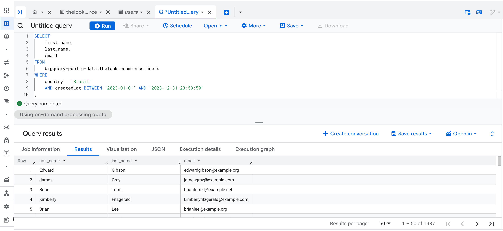

### 2. Аналіз асортименту товарів
**Завдання:** Підрахувати кількість товарів у кожній категорії.
* **Технічна реалізація:** Застосовано агрегатну функцію `COUNT(*)` у поєднанні з групуванням `GROUP BY category`. Результати відсортовані за спаданням (`ORDER BY DESC`).
* **Результат:** Визначено найбільш та найменш наповнені товарні категорії магазину.

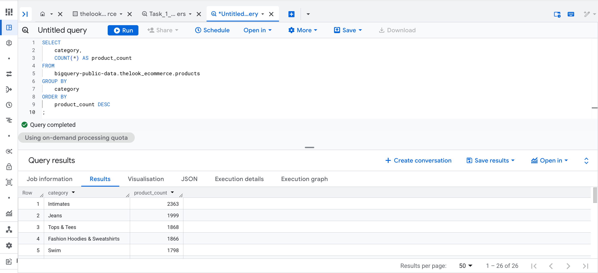

### 3. Аналіз замовлень 
(Об'єднання даних через JOIN)
**Завдання:** Вивести ідентифікатори замовлень, імена та прізвища клієнтів для всіх замовлень, що мають статус 'Shipped'.
* **Технічна реалізація:** Використано **`INNER JOIN`** (записано як `JOIN`) для об'єднання таблиць `orders` (o) та `users` (u) за спільним ключем `user_id`. Це дозволяє отримати лише ті записи, де замовлення має відповідного користувача.
* **Результат:** Сформовано деталізований звіт з логістики, де технічні ID замовлень пов'язані з реальними іменами покупців.

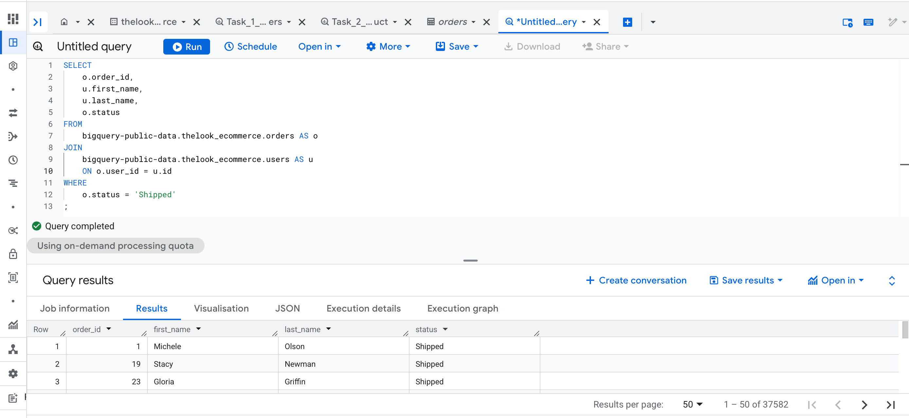

### 4. Фінансовий аналіз — Топ-10 найдорожчих замовлень
**Завдання:** Знайти 10 замовлень з найбільшою сумарною вартістю товарів.
* **Технічна реалізація:** * Використано **підзапит (Subquery)** для створення віртуальної таблиці `virtual_table`.
    * У підзапиті застосовано агрегацію `SUM(sale_price)` та аналітичну віконну функцію **`RANK() OVER`** для ранжування замовлень за вартістю.
    * Зовнішній запит відфільтрував лідерів рейтингу за умовою `WHERE rank <= 10`.
* **Результат:** Виявлено найбільш прибуткові замовлення, що дозволяє аналізувати поведінку VIP-клієнтів.

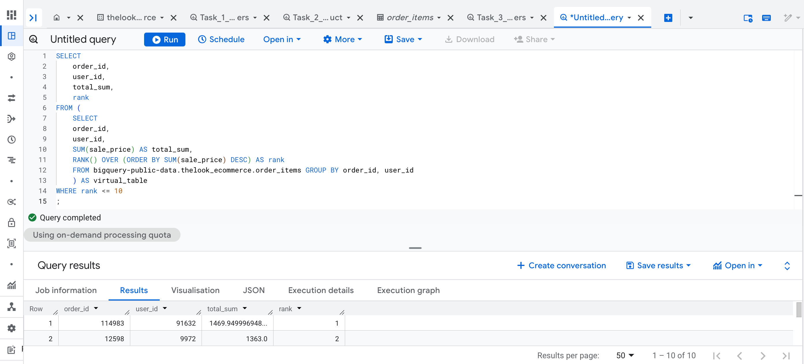

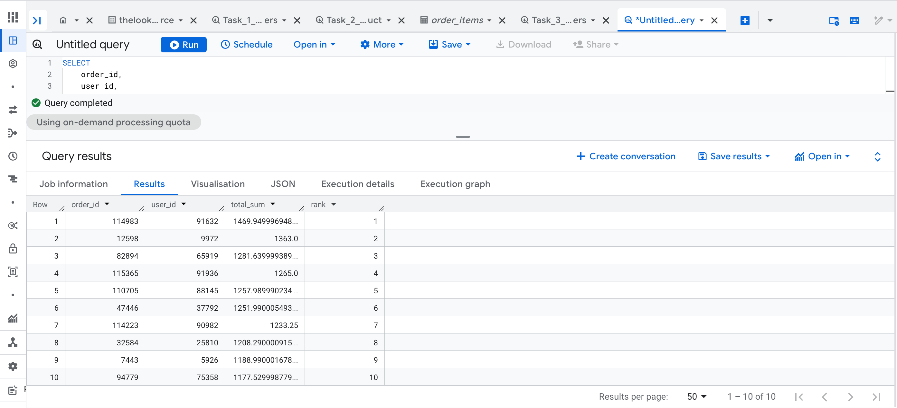

### 5. Географія покупців (Аналіз активних ринків)
**Завдання:** Порахувати кількість унікальних користувачів у кожній країні та вивести ті, де їх кількість перевищує 500.
* **Технічна реалізація:** Застосовано `COUNT(DISTINCT id)` для точного підрахунку унікальних профілів та оператор **`HAVING`** для фільтрації результатів після групування.
* **Результат:** Отримано список з 11 ключових країн, які є основними ринками збуту для платформи (на чолі з Китаєм, США та Бразилією).

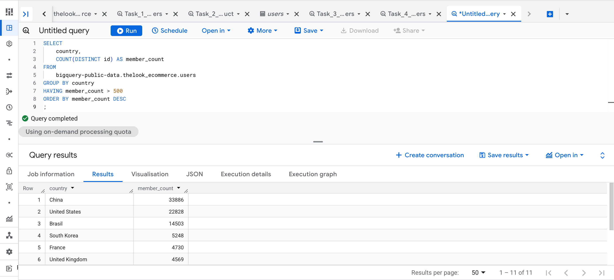

## Частина 2. Опис Tableau проекту: Візуалізація бізнес-метрик ecommerce та прогнозування 
Проаналізувати динаміку продажів за останні роки для виявлення закономірностей споживчої поведінки й ефективного розподілу маркетингового бюджету та представити результати у вигляді інтерактивного дашборду.

---

## Виконані завдання

### 1. Динаміка доходів
**Завдання:** Побудувати графік `Line Chart` доходів з 2022 року по теперішній час.
* **Технічна реалізація:** Створено лінійний графік `Net Amount Dynamics` з додаванням аналітичної лінії тренду та функції `Forecast` для визначення майбутніх обсягів продажів.
* **Результат:** Дані демонструють виражену сезонність. Зафіксовано піковий дохід у грудні 2023 року (3.9 млн). Прогноз вказує на поступове зростання доходів компанії у довгостроковій перспективі (грудень 2026-3.1 млн)

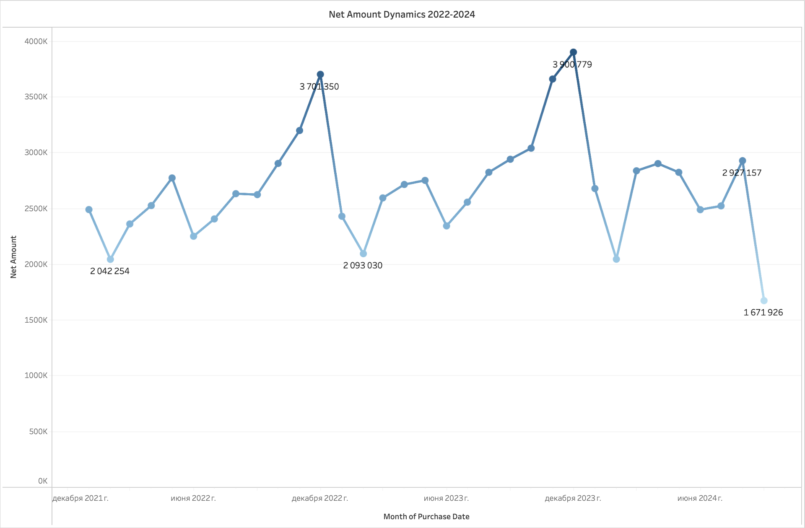
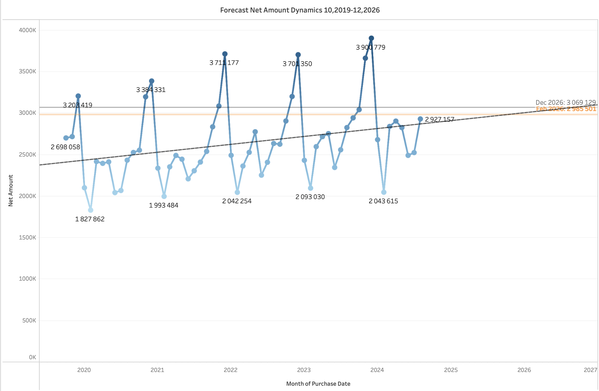

### 2. Ефективність знижок
**Завдання:** Створіть стовпчикову діаграму `Bar Chart`, яка порівнює середній чек `Net Amount` та `Gross Amount` для покупок, здійснених зі знижкою `Discount Applied`, та покупок за повну ціну. Додайте підписи значень на графік.
* **Технічна реалізація:** Використано стовпчикову діаграму для порівняння метрики `Average Bill` у розрізі категорій `Full Price` та `Discounted`.
* **Результат:** Аналіз середнього чека показав, що замовлення зі знижкою (2 737) на 9,1% нижчі за замовлення без знижки (3 013). Це вказує на те, що потріно провести кореляції з рівнем конверсії.

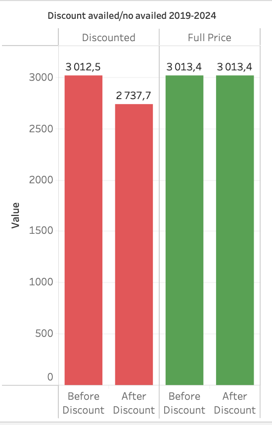

### 3. Творче завдання: Портрет покупця та категорії
**Завдання:** Визначити найбільш популярні категорії товарів у розрізі вікових груп.
* **Технічна реалізація:** Побудовано `Stacked Bar Chart`. для відповіді на питання про уподобання покупця.
* **Результат:** Категорія "Electronics" стабільно формує 30% продажів, підтверджуючи свій статус універсального стратегічного товару для всіх вікових сегментів.

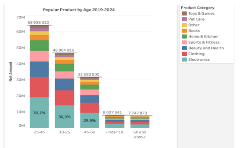

### 4. Аналітичні питання
**Завдання:** Порівняння груп клієнтів: Група А (чоловіки) та Група Б (жінки) за для визначення принесення більшого доходу, визначення вищого середнього чеку та схильності придбання товарів із знижкою. 
* **Технічна реалізація:** Для аналізу було використано `Donut Char`, `Stacked Bar Chart` та `Heat Map Table`
* **Результат:** Звіт демонструє високу рівномірність клієнтської бази. Різниця між групами за загальним доходом та середнім чеком мінімальна (не перевищує 1-2%).

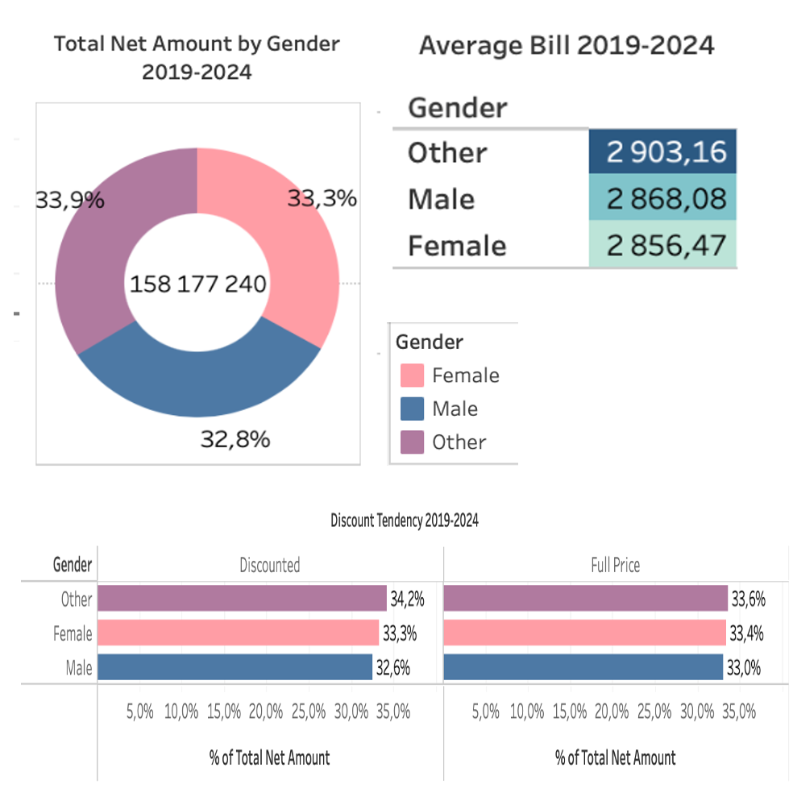

* **Інтерактивна версія:** [Переглянути дашборд у Tableau Public](https://public.tableau.com/views/Project_finalDTA/Dashboard?:language=en-US&:sid=&:redirect=auth&:display_count=n&:origin=viz_share_link)

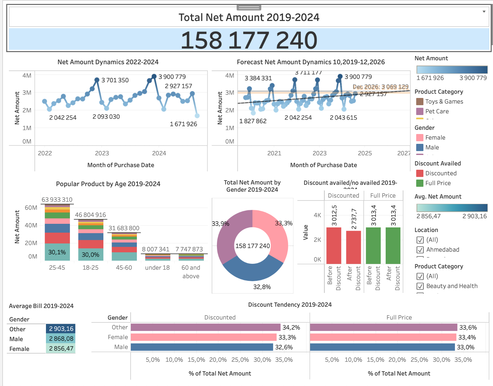

**Висновок:** Бізнес знаходиться у фазі активного розвитку з позитивним прогнозом до 2026 року. Головне завдання на наступний період — перехід від масового маркетингу до більш цілеспрямованого підходу шляхом кращого розуміння профілів клієнтів у групі «Other».

# Результати та цінність проекту
Успішна інтеграція SQL-аналітики та візуалізація в Tableau дозволили перейти від простого порівняння статистики до формування чітких стратегічних рекомендацій для розвитку двох різних бізнес-структур.